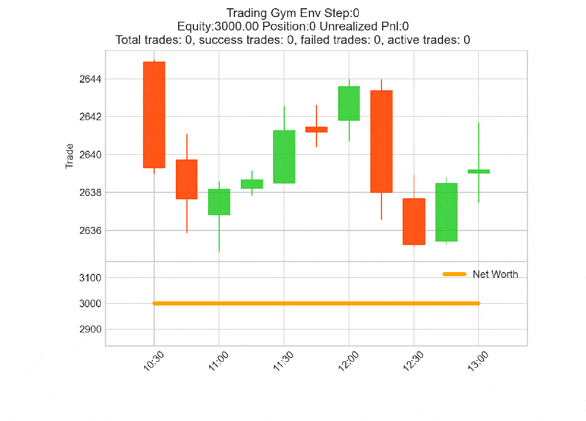

# Gym Trading Environment

QTrade ships a [Gymnasium](https://gymnasium.farama.org/) environment
(`qtrade.env.TradingEnv`) that wraps the same `Broker` as
`Backtest`. The agent steps through bars one at a time; same accounting,
fill semantics, SL/TP behavior — just driven by `step()` instead of a
Python loop.

For customizing the action / observation / reward, see
[Customizing Trading Environment](customize_environment.md).

## Initializing

```python
import yfinance as yf
from qtrade.env import TradingEnv
from qtrade.core.commission import PercentageCommission

data = yf.download(
    "GC=F",
    start="2022-01-01",
    end="2024-01-01",
    interval="1d",
    multi_level_index=False,
)

# Indicators added to the DataFrame become observable features by default.
data['Rsi'] = data['Close'].pct_change().rolling(14).mean()  # placeholder for ta.rsi
data['Diff'] = data['Close'].diff()
data.dropna(inplace=True)

env = TradingEnv(
    data=data,
    cash=3000,
    commission=PercentageCommission(0.001),
    window_size=10,        # observation lookback (also defines warmup)
    max_steps=400,         # max bars per episode
    random_start=False,    # start at index `window_size`
    trade_on_close=True,   # market orders fill at current bar's close
)
```

The default `ObserverScheme` returns a `(window_size, n_features)`
window of every column except OHLCV. So the indicators you add to the
DataFrame become the observation features automatically.

## The step API

`env.step(action)` returns the standard 5-tuple:

```python
obs, reward, terminated, truncated, info = env.step(action)
```

| Field | Meaning |
|---|---|
| `obs` | Whatever the `ObserverScheme` produces. Default: `np.ndarray` of shape `(window_size, n_features)`. |
| `reward` | `RewardScheme.get_reward(env)`. Default: log-return of trades closed this step minus commission. |
| `terminated` | `True` iff `current_step >= len(data) - 1` — the data ran out. |
| `truncated` | `True` iff `current_step - start_idx >= max_steps` — the episode hit its time limit. |
| `info` | Dict (see below). |

When either `terminated` or `truncated` becomes True, the broker calls
`close_all_positions()` automatically — the episode is "settled" before
returning.

### What's in `info`?

Every step:

| Key | Meaning |
|---|---|
| `equity` | `broker.equity` (cash + unrealized PnL). |
| `unrealized_pnl` | `broker.unrealized_pnl`. |
| `cumulative_return` | `broker.cumulative_returns` — multiplicative growth since the episode start. |
| `position` | Net signed `position.size`. |
| `total_trades` | Count of closed trades so far this episode. |
| `trades_profit` | Sum of `profit` across all closed trades. |
| `avg_trade_duration` | Mean `exit_index − entry_index` in bars (0 if no trades). |
| `is_success` | `trades_profit > 0`. Useful for SB3's `EvalCallback` success-rate logging. |

If you need additional fields (open trade count, drawdown so far,
specific trade properties), subclass `TradingEnv` and override `step`
to extend the dict.

## Episodes: terminated vs truncated

The Gymnasium convention is:

- **`terminated`**: the episode reached a *natural* end (won, lost, or
  ran out of valid states).
- **`truncated`**: the episode was *cut* by an artificial time limit.

In `TradingEnv`:

- `terminated` fires when there's no more data
  (`current_step == len(data) - 1`). The episode is "complete."
- `truncated` fires when `max_steps` is reached. The episode could
  have continued but you set a budget.

`stable-baselines3`'s value bootstrapping treats them differently —
make sure you set `max_steps` short enough that most episodes truncate
(so the agent learns from many short episodes), but not so short that
the strategy never has time to play out.

## `random_start` for episode diversity

By default `random_start=False`: every episode starts at bar index
`window_size`. With `random_start=True`, each `reset()` picks a random
start in `[window_size, len(data) - max_steps)`, so episodes sample
different market regimes.

Required: `len(data) > window_size + max_steps`. The constructor
raises a clear `ValueError` if not — keep `max_steps` < `len(data) -
window_size` to leave room.

## A typical training loop

```python
from stable_baselines3 import PPO

model = PPO("MlpPolicy", env, verbose=1)
model.learn(total_timesteps=200_000)

obs, _ = env.reset(seed=42)
for _ in range(400):
    action, _ = model.predict(obs, deterministic=True)
    obs, reward, terminated, truncated, info = env.step(action)
    if terminated or truncated:
        break

env.show_stats()
env.plot()
```

`env.show_stats()` and `env.plot()` work the same as on a `Backtest`
instance — same metrics, same multi-panel Bokeh report — because they
both delegate to the underlying `Broker`.

## Rendering

`env.render('human')` opens a live mplfinance candle chart updating
every step:



For RGB array output (e.g. SB3's `VecVideoRecorder`):

```python
env = TradingEnv(..., render_mode='rgb_array')
frame = env.render()  # → ndarray of shape (h, w, 3)
```

> Heads up: rendering is slow. For training, leave it off
> (`render_mode='human'` is the default but you don't have to *call*
> `render()`) and only render during evaluation.

## Common pitfalls

- **Sparse reward**: the default reward only fires on bars where a
  trade closes. Long episodes with no closures train poorly. Either
  use an equity-based reward (see
  [Customizing Trading Environment](customize_environment.md)) or shorten
  episodes so end-of-episode auto-closure provides regular signal.
- **Indicators with NaN at start**: any column you add to `data` is
  observed as-is. NaN in the observation crashes most policies. Drop
  the warmup rows with `data.dropna(inplace=True)` after computing
  indicators.
- **Action / observation drift**: if you change schemes mid-experiment
  and load an old model, you'll get shape mismatches. Save model and
  scheme together when you're going to load.
